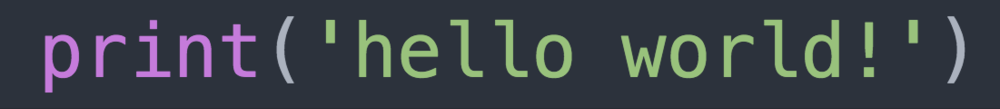

# MIAP Digital Literacy Practice Repository!

Welcome to the practice repository! 

## Setting up Github :^)

1. If you don't already have one, Set up an account on <https://github.com>. Save your new account in your favorite password manager. If you don't have a password manager, consider getting one: <https://en.wikipedia.org/wiki/Password_manager>

2. Install GitHub Desktop on your computer: <https://desktop.github.com/>

## How to Start the Practice Excercise

1. Go to <https://github.com/jmf-nyu/miap_diglit> and fork the repository by clicking the "Fork" button in the top right corner of the browser window. This will create a copy of the repository in your own account.

2. Open GitHub Desktop and make sure you are logged in.

3. Click the "Clone a repository from the Internet" button

4. Choose the forked repository in your account

5. Always click "Fetch Origin" and merge new changes before starting any new work.

6. See [the command line guide to get get an idea of what you're working on](/docs/index.md). Use the entry for [ls](/docs/ls.md) as a template for your new command line page. You can choose from the commands in the list or add a new one.
7. Create a new markdown file titled `[command you want to write about].md`. Make sure that this is in the `docs` folder.
8. Hack away on your local computer! Add some text, images, URLs, code snippets to the .md file to describing your command in BASH.
9. Save your new .md file.
10. Commit your changes.
11. If you are working on your local computer, push your chages to GitHub.com
12. Submit a pull request.

## Checking the Results

1. Check to make sure the pull request is approved. If it is not approved, you may need to make changes. Check the [GitHub page](https://jmf-nyu.github.io/miap_diglit/)

## For Reference
GitHub guide to Markdown: <https://guides.github.com/features/mastering-markdown/>

## Make a Contribution
See the resources here: <https://github.com/amiaopensource/time-based-media-art> and if you see something missing, make a contribution!
