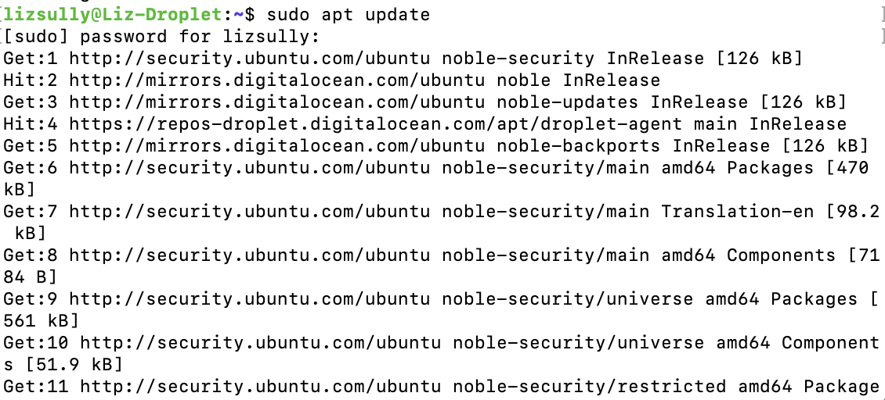
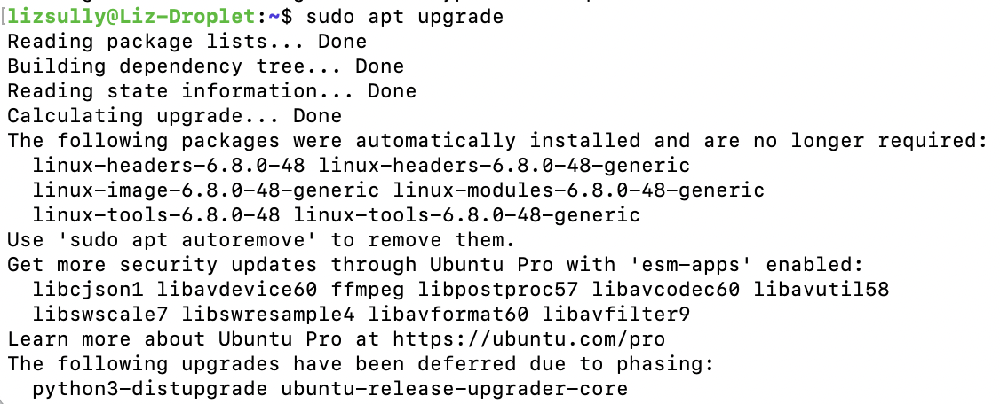
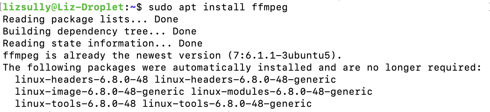

# apt BASH in the Command Line!

## Summary 

 What is the apt BASH command? 

 I am so glad you asked! 

 Used to install software packages through the command line, apt has many applications that make it exceptionally helpful for unpacking updates and new software. 

 In order to use this command, you must have sudo/super-user privileges on your server or computer. If you are using your personal computer, you should be able to use this command without getting sudo permissions. 

## Basic command structure
For all descriptions below, the dollar sign indicates that BASH command prompt.

$ `sudo apt [argument]

Note: check your spelling, use tab completion  

## Possible Arguments

### `update`
Updates package lists from repositories

 Example 

 
 $ sudo apt update 

### `upgrade`
Upgrades installed packages to their latest versions

 Example 

 $ sudo apt upgrade 
 

### `install`
Installs new software packages

 Example 

 $ sudo apt install 
 

## Outputs using apt Command

* **Output with `update` argument**
 

* **Output with `upgrade` argument**

* **Output with `install` argument**

Go back to the [main list of commands](index.md)
