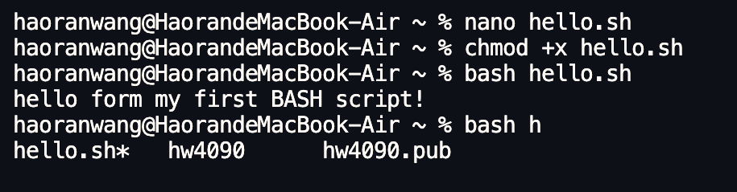

# Simple BASH Scripts

## Summary
A simple BASH script is a plain text file that contains one or more commands you would normally type at the command prompt. Instead of typing the same commands again and again, you can save them in a script and run the script as one command.

## Basic script structure 
For all descriptions below, the dollar sign indicates the BASH command prompt.

A very simple BASH script looks like this:

```bash
#!/usr/bin/env bash
echo "Hello from my first BASH script!"
```

The first line is called the “shebang” and tells the system to use `bash` to run the file.  
The rest of the lines are normal BASH commands.

## Creating and running a script

To create a new script file, you can use a text editor such as `nano`:

```bash
$ cd ~
$ nano hello.sh
```

Inside the file, type:

```bash
#!/usr/bin/env bash
echo "Hello from my first BASH script!"
```


Save and exit the editor. 

Now you have a file called `hello.sh` in your home directory.

Next step, You must give it execute permission so that the system can run it as a program:

```bash
$ chmod +x hello.sh
```

You can run the script by calling `bash` directly:

```bash
$ bash hello.sh
```

## Output

```bash
Hello from my first BASH script!
```

## Using tab completion with your script 

After you create and save a script file (for example `hello.sh`), you can already use tab completion on its name **if you are in the same directory** as the file.

For example, if you ran:

```bash
$ nano hello.sh
$ chmod +x hello.sh
```

and you are still in the directory that contains hello.sh, you can type:

```bash
$ bash hel<Tab>
```

The shell will complete this to:

```bash
$ bash hello.sh
```

**This method will save you time when naming different scripts.**



Go back to the [main list of commands](https://jmf-nyu.github.io/miap_diglit/)
