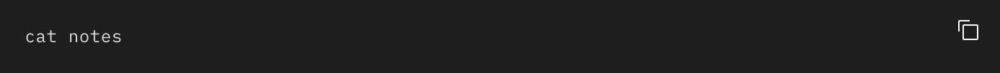
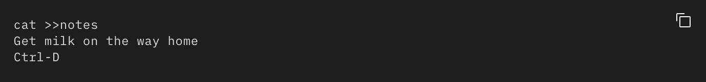

# The cat Command

## Summary 
The `cat` command concatenates or displays files. The command has many options which are described below.
## Basic command structure
`cat [flag] [file]`
The cat command reads each File parameter in sequence and writes it to standard output. If you do not specify a file name, the cat command reads from standard input. You can also specify a file name of `-`(dash) for standard input.

## Possible Flags

### `-b`
The `-b` flag omits line numbers from blank lines, when specified with the -n flag.

### `-e`
The `-e` flag displays a $ (dollar sign) at the end of each line, when specified with the -v flag.

### `-n`
The `-n` flag displays output lines preceded by line numbers, numbered sequentially from 1.

### `-r`
The `-r` flag replaces multiple consecutive empty lines with one empty line. This flag is identical to the `-S` flag.

### `-t`
The `-t` flag displays tab characters as ^I if specified with the -v flag.

## Exit Status
`0` All input files were output successfully.
`>0` An error occurred.

## Examples 
To display a file at the workstation, enter:

To add text to the end of a file, enter:

