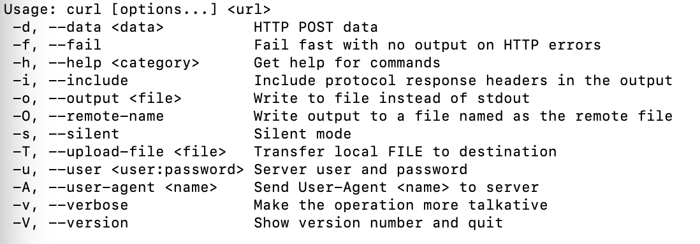
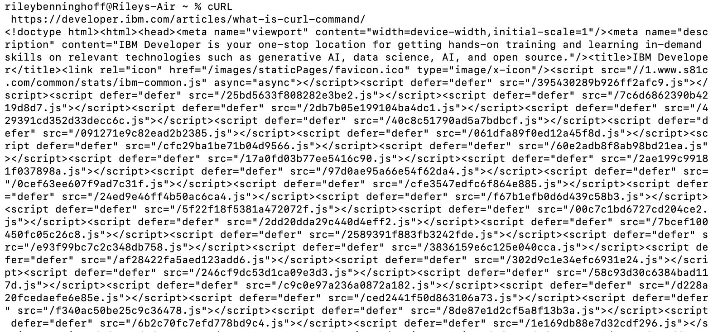

# The cURL Command

## Summary
The `cURL` command stands for "client URL." Essentually, the command permits the transfer of data to and from a server, with specifying the location of the data that you desire to send through the form of a URL. It is especially helpful in sending API requests, checking that servers are recieving requests.

## Basic Command Structure
For all descriptions below, the dollar sign indicates that BASH command prompt.

$ `cURL [options] [url]`

## Possible Flags

In order to view this list in Terminal use:

$ `cURL -h`

## Output
Example of a possible output:
$ `cURL https://developer.ibm.com/articles/what-is-curl-command`

This example, not a complete image due to size of results, depicts how data is pulled from the indicated location or server.
