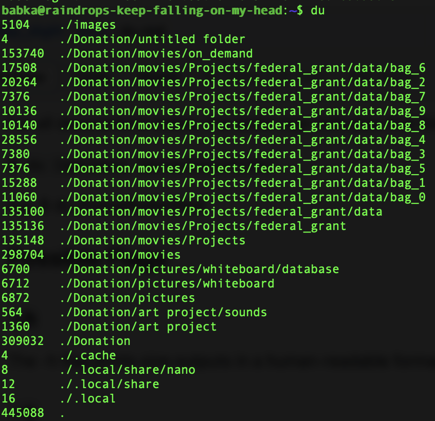
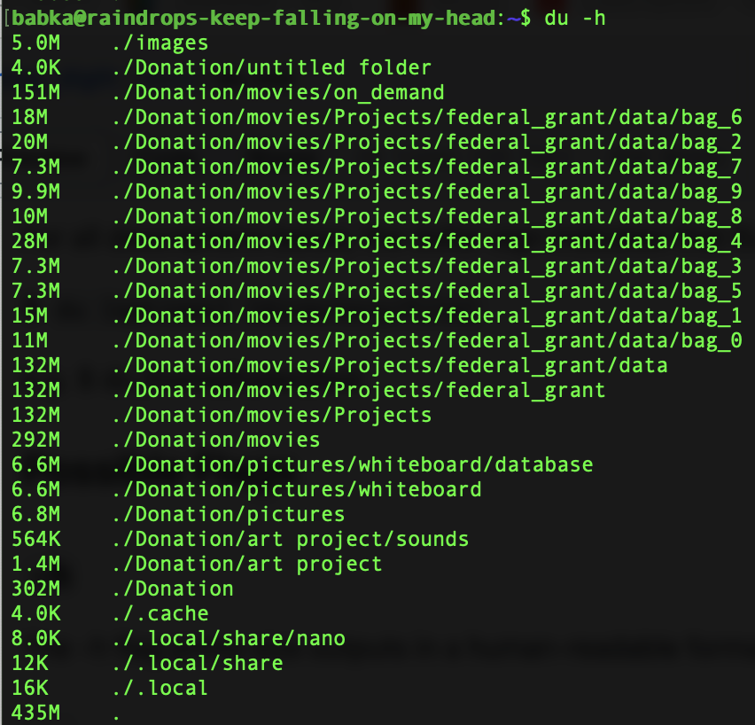

# The du Command

## Summary 
The `du` command allows a user to quickly find disk usage information.

## Basic command structure
For all descriptions below, the dollar sign indicates that BASH command prompt.

$ `du [options] [directory/file]`

e.g. $ du /home/ltallen/test

## Possible Flags

### `-h`
The -h flag prints size outputs in a human-readable format

### `-s`
The -s flag is added to the -h flag on occasion. Combined, they allow us to get a summary of the directory's usage in a human-readable format.

### `-a`
This option lists the sizes of all files and directories in the given file path. The -a option is often combined with the -h flag for ease of use. Notice the individual file sizes are listed with the directories.

## Output

* **Standard output** with no flags:

* **Output with `-h` flag**, which prints size outputs in a human-readable format:

Go back to the [main list of commands](index.md)
