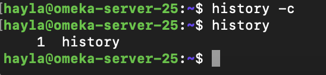
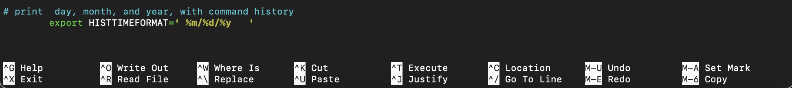
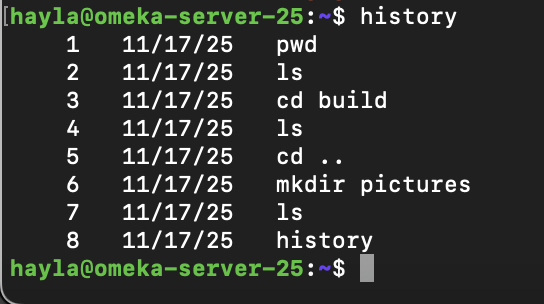

# The history Command

## Summary 
The `history` command allows you to display and manipulate the history list. 

The command has many options which are described below. 

## Basic command structure
For all descriptions below, the dollar sign indicates the BASH command prompt.

$ `history [options]`

## Possible Flags

### `-c`
The `-c` flag clears the entire history list by deleting all entries. 

### `-d offset`
This option removes history at a given postion or "offset." The offset is the line number of the command that you want to remove. The following example removes line 252 from the history list:

	history -d 252

Negative offsets will count backwards from the end of the history list. If you make a mistake or run a command that you don't want to record in the history list, you might use: 

	history -d -2

To remove sequential entries, use a hyphen to seperate the start and end of a given range.

	history -d START_NUMBER-END_NUMBER
	
### `-a`

The `-a` flag appends history lines from this session to the history file. This flag can be useful when you want to save commands from the current session to a seperate file. To do this you would add a file name, for example:

	history -a my_project_commands.txt

Save this file to a specific folder by adding a redirect, for example:

	history -a my_project_comamnds.txt > path/to/folder

### `-r`

The `-r` flag reads a history file and appends the contents to the current history list. This can be used to append a .txt file to the history list. 
      
### `-n`	

The `-n` option refers to a number of entries. When used with the history command, this option will return only the last 'n' commands. To show only the last 10 entries, for example, use:

	history 10 

### `-w`

The `-w` flag adds the current history list to the history file.
    
### `-p`   

The `-p` flag will perform a history expansion on each argument and display the result without storing it in the history list. More simply, this flag allows you to print a command from the history list without executing it. 
     
### `-s`	

The `-s` flag will store the arguments within the history list as a single entry.

### `!`

An exclamation point may also be used to interact with the history list. Run any commnand from the list by combining an exclamation point with the line number or a text string. Add a `:p` argument to return a command using an exclamation point without executing it.

	![string]:p

## Additional Search tools

### Using `history` with `grep`

When the `history` command is combined with grep, the returned list will only show lines containing a specific keyword or command. For example, the following command will only return entries where `ls` was used: 

	history | grep "ls"

### `CTRL-R` 

`CTRL-R` can be used to perform a “reverse-i-search”. For example, to use a command from the last time you accessed a web server, you might search the name of the server: 

	PRESS [CTRL] + [R] then type “apache2”.

What you will see in the console window is:

	(reverse-i-search)`':
	
After you have typed what you are looking for, use the `CTRL-R` combination to scroll backward through the history. Once you've found the command you're looking for, use `[Enter]` to execute it.

Alternatively, using the right or left arrow keys will place the command on an actual command-line so you can edit it.

## Output

Each entry of the history list contains a line number followed by a command in descending order of execution:

The list corresponds to a hidden file in the home directory that can be opened with a text editor such as nano: 

	$ sudo nano ~/.bash_history

### Using Date and Timestamps

The bash shell stores a `.bashrc` file containing format settings for the output of the history command. To modify these settings, open a text editor, such as Nano using the command:

Change the output format to include date and timestamps by adding the following variable to the `.bashrc` file with the desired arguments:

	%d. Day.
	%m. Month.
	%y. Year.
	%H. Hour.
	%M. Minutes.
	%S. Seconds.
	%F. Full date (Y-M-D format).
	%T. Time (H:M:S format).
	%c. Complete date and timestamp (Day-D-M-Y H:M:S format).

Here are the results of this variable change, notice how including spaces within the variable affects the output:
		

### Modifiers for history capacity 

The history list size is set to a default. Modify this default by changing the HISTSIZE variable in the .bashrc file. For example, 100 entries: 

    HISTSIZE=100

The history file size can also be modified. For example, 5,000 entries:

    HISTFILESIZE=5000

Either variable can also be set to -1, this will yield unlimited entries:

  	export HISTSIZE=-1
    export HISTFILESIZE=-1

## For more information about the history library, access the GNU Histroy Library manual using command:

	man history

Go back to the [main list of commands](index.md)
