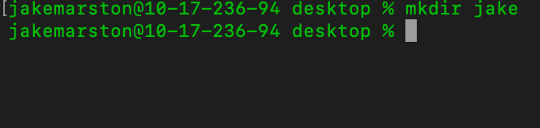
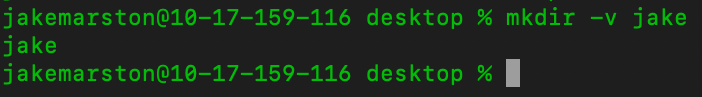

# The mkdir Command

## Summary 
The `mkdir` command creates new directories or subdirectories. The command has a few options which are described below. 

## Basic command structure
For all descriptions below, the dollar sign indicates that BASH command prompt.

$ `mkdir [options] [directory name]`

## Possible Flags

### `-m`
The `-m` flag sets permission mode. 

### `-p`
The `-p` flag makes parent directories as needed.  

### `-v`
The `-v` flag prints a message for each created directory. 

## Output
The `mkdir` command has a few different kinds of outputs as described below:
* **Standard output** with no flags, which creates the new directory within the directory where the command is run:

* **Output with `-v` flag**, which prints a message in the command line pertaining to the directory:

## Examples 
* If you want to create multiple directories run $ `mkdir [directory name] [directory name]`.
* To create directories inside of directories: $ `mkdir -p [directory name]/[directory name]`. Here's an example: $ `mkdir -p jake/time`

Go back to the [main list of commands](index.md)
