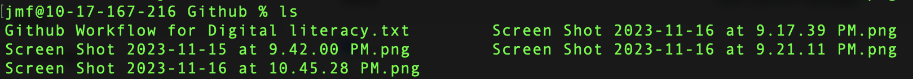
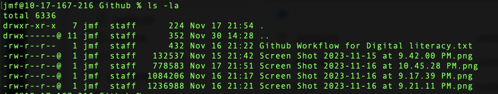

# The ls Command

## Summary 
The `ls` command lists the contents of a directory including both files and directories. The command has many options which are described below. 

## Basic command structure
For all descriptions below, the dollar sign indicates that BASH command prompt.

$ `ls [options] [directory path]`

Note: If you do not specify a directory path, running `ls` will show you the contents of the current directory you are in within your terminal window, i.e., your current working directory.

## Possible Flags

### `-a`
The `-a` flag shows files that are normally hidden by BASH. These are files that begin with a `.` such as [.DS_Store](https://en.wikipedia.org/wiki/.DS_Store), [.bashrc](https://en.wikipedia.org/wiki/Bash_(Unix_shell)#Startup_scripts), or .bash_history.

### `-l`
The `-l` flag gives a column view of files and directories. It also gives information about those files and directories including permissions, last date modified and size.

### `-h`
When used in combination with the `-l` flag, the `-h` flag displays file size in human-readable units such as kilobytes, megabytes, and gigabytes.

## Output
The `ls` command has many different kinds of outputs as described below:
* **Standard output** with no flags, which displays the names of directories and files within the directory where the command is run:

* **Output with `-l` flag**, which displays directories and files in a list form with metadata in colums:

## Examples 
* If you want to see hidden files in a nice list format run $ `ls -la ~`. The `~` would indicate your home folder.
* To get a the contents of an entire directory structure starting at a parent folder: $ `ls -alRt`. If you'd like, you can use a redirect, such as `>` to send the output to a text file. Here's an example: $ `ls -alRt ~/Desktop > ~/Desktop/report.txt`

Go back to the [main list of commands](index.md)
