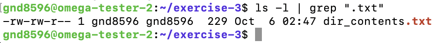

# The pipe operator

## Summary 
The `|` (pipe) operator takes the standard output of the command on the left, and pipes it as standard input to the command on the right. You can chain multiple commands using multiple pipes. The output of each command flows to the input of the next command in the chain. Think of this as redirecting the output of one command into another. 

## Basic pipe structure
For all descriptions below, the dollar sign indicates that BASH command prompt.

$ `command1 [options] | command2 [options]`

Note: [options] belong to the commands on either side of the pipe, not to the pipe itself.

## Common pipe commands

### `grep`
Using `grep` with a pipe lets you filter output for specific patterns.
For example: 
$ `ls | grep ".txt"` 

### `wc`
The `wc` command with a pipe can count lines, words, or characters in the output of another command.
For example: 
$ `cat file.txt | wc -l` 

### `sort`
The `sort` command organizes the output of a previous command alphabetically or numerically. 
For example: 
$ `cat names.txt | sort`

### `uniq`
The `uniq` command removes duplicate lines from the output of a previous command. It is often combined with sort.
For example: 
$ `cat colors.txt | sort | uniq`

## Output
The `|` operator creates a continuous flow of data from one command to another:
* **Standard output**, which shows the output of a command run by itself, before being piped:
$ `ls -l`

* **Output passed through a pipe**: shows how the output of the first command flows into the second command. For example, listing all files and filtering only `.txt` files:
$ `ls -l | grep ".txt"`

## Examples 
* To see only `.txt` files in a directory:  
$ `ls -l | grep ".txt"`  
This command lists all files with ls -l and then uses grep to display only those with .txt in their names.

* To count the number of files in a directory:  
$ `ls | wc -l`  
`ls` lists the files and `wc -l` counts the lines.

Go back to the [main list of commands](index.md)