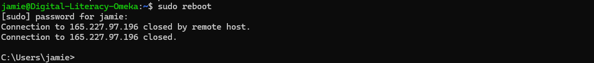

# The Reboot Command

## Summary 
The `reboot` command can be used to reboot a computer or remote server. It will notify logged-in users about the reboot. The command has several options which are described below.   

## Basic command structure
For all descriptions below, the dollar sign indicates a BASH command prompt.

$ `reboot [options]`

## Possible Flags
`-f`
* The `-f` flag will force an immediate reboot without running normal shutdown procedures. This is best used only when absolutely necessary as it can cause significant issues.

`--no-wall`
* The `--no-wall` flag will reboot without notifying logged-in users. 

## Output
* **Standard output** The `reboot` command usually does not have an output, as the result of the command should be the system beginning its reboot process. When rebooting a remote server, you will receive a message that the connection to the server has been closed. If "operation not permitted" is returned, you need `sudo` access. Make sure to have your `sudo` password on hand. 
* **Note** Rebooting your remote server will kick you and any other logged-in users off the server while it reboots. This process usually takes a few minutes, after which you will need to connect again.

## Examples 
* If you want to quickly reboot your server, run $ `sudo reboot`. You generally need `sudo` permissions to run `reboot`.
* To force an immediate reboot, run $ `sudo reboot -f`. This command is usually a last resort. 

Go back to the [main list of commands](index.md)
