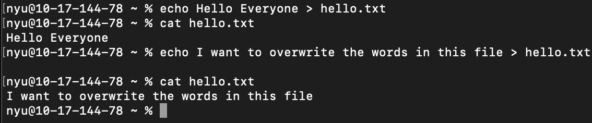
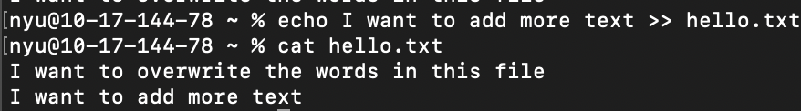

# Redirects

## Summary 
Redirection assists in redirecting input & output functionalities to the files or folders we want. There are 2 types of redirection:

*1. Overwrite Redirection*

The `>` command

> This will store/save the output of a command to a file & overwrite existing content of that file.

*2. Append Redirection*

The `>>` command 

>This will redirect the standard output of a command on the left of `>>` & append it to the end of the file on the right of `>>`. 
> This will not compromise the existing data of the file it is added to.

## Basic command structure
For all descriptions below, the dollar sign indicates that BASH command prompt.

$ `[command] > [file name]` 

$ `[command] >> [file name]`

## Use Examples
The redirect commands have many different uses as shown below:
* **Overwrite Redirection** - shows the use of redirecting a command into a text file and how the `>` command will overwrite. 

* **Append Redirection** - shows the use of appending into a text file with `>>`

Go back to the [main list of commands](index.md)
