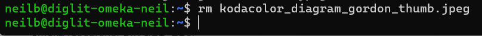
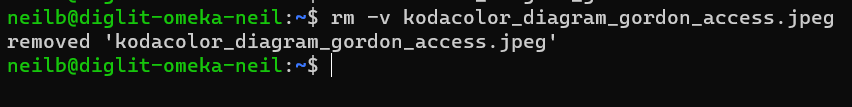

# The rm Command

## Summary 
The `rm` command removes files you no longer need. It removes the entries for a specified file, group of files, or certain select files from a list within a directory. User confirmation, read permission, and write permission are not required before a file is removed when you use the `rm` command. However, you must have write permission for the directory containing the file.

## Basic command structure
For all descriptions below, the dollar sign indicates that BASH command prompt.

$ `rm [option] [file name]`

## Possible Flags

### `-i`
The `-i` flag will ask before deleting each file. Some people will have rm aliased to do this automatically (type "alias" to check). Consider using rm -I instead, which will only ask once and only if you are trying to delete three or more files.

### `-r`
The `-r` flag will recursively delete a directory and all its contents (normally rm will not delete directories, while rmdir will only delete empty directories).

### `-f`
The `-f` flag will forcibly delete files without asking; this is mostly useful if you have rm aliased to ``rm -i'' but want to delete lots of files without confirming each one.

## Output
The `rm` command has many different kinds of outputs as described below:
* **Standard output** with no flags, will display no output:

* **Output with `-v` flag**, which will actually bring up an output:

A standard `rm` command, without the `-v` flag, will generally only give outputs if there is an error.

## Examples 
* If you want to remove multiple files at the same time, run $`rm [file name] [file name]`, with as many file names as you want. 
* To delete an empty directory, use the -d flag, like this: $`rm -d [directory path]`

Go back to the [main list of commands](index.md)
