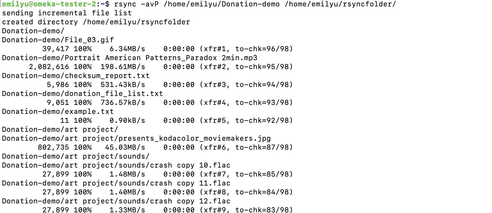
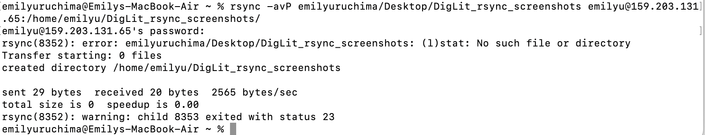
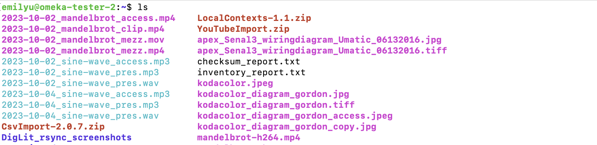

# The Rsync Command

## Summary 
Rsync is a command-line tool designed for file and directory synchronization.

Unique to the rysnc command is its use of a delta-transfer algorithm. Before transferring, rsync compares the source and destination files. By default, it identifies changes by checking modification times and file sizes. If a file has been modified, the algorithm determines which specific parts of the file have changed and sends only those differences.

## Basic command structure
For all descriptions below, the dollar sign indicates that BASH command prompt.

$ `rsync [options] [source] [destination]`

OPTIONS: These are flags that modify rsync's behavior.`

SOURCE: The path to the file or directory you want to copy or synchronize. This can be local or remote (e.g., user@remotehost:/path/to/source).`

DESTINATION: The path where you want to copy or synchronize the files. This can also be local or remote.`

## Possible Flags

### `-a`
The `-a` (archive mode) flag is recommended for most use cases because it syncs recursively while preserving permissions, ownership, and modification times.

### `-v`
The `-v` (verbose) flag shows detailed information about the transfer process.

### `-z`
The `-z` (compress) flag compresses data during transfer, useful for remote operations. 

### `-b`
The `-b` (backup) flag makes backups of files that are going to be overwritten or deleted during synchronization. 

### `-P`
The `-P` combines --progress (shows transfer progress) and --partial (allows resuming interrupted transfers). 

### `-n`
The `-n` (dry run) flag previews outcomes of rysnc without actually making any changes to files. Useful for testing.

## Output
The `rsync` command differs in outputs, depending on the options you decide to use:

Note: The following command was done using my remote server. Files and folders are all from Class 5, and for the sake of this exercise, I have created an "rsyncfolder" (in my remote server).

* **Output** with `-a,``-v``-P` flags, for local synchronization (archive mode, verbose, progress):

In this example, I used `rsync` to synchronize "Donation-demo" folder within my remote server, into another new folder titled "rsyncfolder."  

The results can be seen here, where all my files from the "Donation-demo" folder are now in "rsyncfolder." 

* **Output** with `-a,``-v``-P` flags, for local server to remote server synchronization (archive mode, verbose, progress):
  

In this example, I used `rsync` to synchronize the "DigLit_rsync_screenshots" folder from my local server to my remote server.

The results can be seen here, where after logging onto my remote server, I could see all my files listed out, including the "DigLit_rsync_screenshots" folder. 

Go back to the [main list of commands](index.md)
