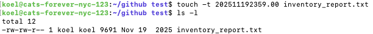
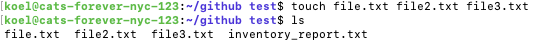

# touch

## Summary 💡
The `touch` command is primarily used to change the access and modification timestamps of a file or directory to the current time. If the file specified by the command does not exist, `touch` will create a new, empty file.

## Basic command structure 🧬
For all descriptions below, the dollar sign indicates the BASH command prompt.
`$ touch [option] [file name]`

## Possible Flags 🚩

`-a`
Changes the access time (time the file was last read) of the file.

`-m`
Changes the modification time (time the file was last written to) of the file.

`-c`
Prevents `touch` from creating the file if it does not already exist.

`-r [reference file]`
Uses both access and modification times of the reference file instead of the current time.

`-t [stamp]`
Modifies a file's access and modification times to a specific date and time. Here, [stamp] follows the date-time [[CC]YY]MMDDhhmm[.ss] format.

## Output 🔍
The `touch` command, similar to other standard commands like `rm` and `chmod`, generally produces no output on success. If the command successfully updates the timestamps or creates a file, no message is displayed. However, an error message will be displayed if the user lacks the necessary permissions to modify the file or the containing directory, or if the specified reference file is not found.

To confirm that the timestamps have been updated, the `-ls -l` command can be used to show file details.

## Examples 📝
* Create a new, empty file: `$ touch newfile.txt`
* Create multiple files: `$ touch file1.txt file2.txt file3.txt`

* Update the timestamps of an existing file using a reference file: `$ touch -r reference.txt existing.txt`
* Specify a particular timestamp for a file's access and modification times: `$ touch -t 202511192359.00 existing.txt`
