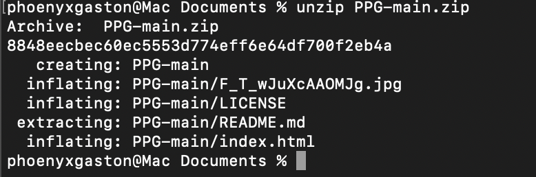

# The unzip Command

## Summary 
The `unzip` command is used to extract files from ZIP archives, preserving directory structures and permissions. The command has many options which are described below. 

## Basic command structure
The simple syntax of the 'unzip' command:

unzip [options] filename.zip

## Possible Flags

### `-d dir`
The `-d dir` Specifies the destination directory listing for extracting documents. This choice allows customers to choose a particular listing in which the contents of the ZIP record may be extracted.

### `-l`
The `-l` Lists the contents of the ZIP file without extracting them. It provides an introduction to files and directories in the archive, together with permissions, compression ratio, and amendment timestamps.

### `-q`
Operates in quiet mode, suppressing normal output for the duration of extraction. This is beneficial when you want to extract files without displaying unnecessary information.

### '-o'
Overwrites documents without prompting for confirmation. This option is available whilst you need to extract documents and replace current files without guide intervention.

### '-p'
Specifies a password for encrypted ZIP files. When handling password-protected archives, use this option to offer the desired password during extraction.

### '-e'
Extracts files from the ZIP archive even while keeping the directory structure. This is useful if you want to keep the equal directory hierarchy as in the archive.

### '-t'
Tests the integrity of the ZIP archive, checking for any mistakes or corruption. It verifies whether or not the archive is legitimate before intending to extract.

### '-u'
Updates current files and adds new files from the ZIP archive. It guarantees that the handiest changed or new documents are extracted, keeping off pointless duplication.

## Output
The `unzip` command has many different kinds of outputs as described below:
* **Basic Extraction** This command extracts all documents from the specified ZIP archive, putting them inside the cutting-edge operating listing. It is the simplest syntax for decompressing and retrieving the contents of a ZIP file:

* **Output with `-l` flag**, To view the contents of a ZIP file without extracting:

## Examples 
* Imagine you want to inspect the contents of 'archive.zip' without executing the extraction process.
* In this scenario, the '-l' option provides a list of files contained within 'archive.zip' without initiating the extraction, allowing you to preview the file structure.
  
Go back to the [main list of commands](index.md)
