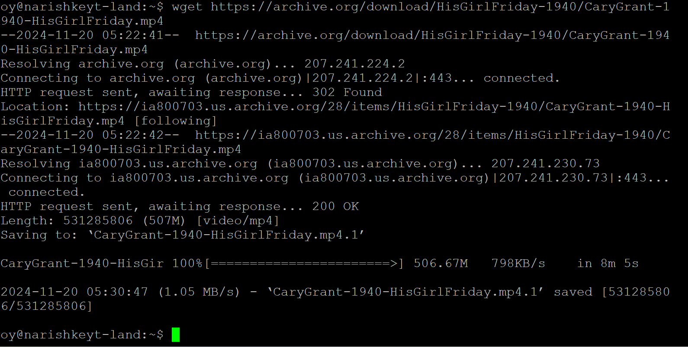
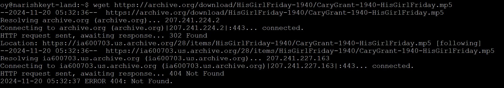

# The ls Command

## Summary 
The `wget` that retrieves files (downloads) from a URL through a variety of internet protocols. Those protocols include HTTP, HTTPS, FTP and FTPS. `wget` has a variety of options that allow the user a lot of choice when downloading files. The URL must be a direct link to the file, otherwise `wget` will download the .html of the site that is hosting the file.

## Basic command structure
For all descriptions below, the dollar sign indicates that BASH command prompt.

$ `wget [options] [URL]`

Note: A URL is always required, options are not. 

## Possible Flags

### `-P`
The `-P` flag specifies a path/directory to where the file(s) are downloaded.

### `-b`
The `-b` flag downloads in the background, further commands can be inputted even if the file(s) have not been fully downloaded yet.

### `-i`
Allows the urls to be extracted from an external file such as a .txt file, however each url must be line-delineated.

## Output
The `wget` command has a variety of error codes that can be outputted to a text file if used with `O`. These include:
0
No problems occurred.

1
Generic error code.

2
Parse error—for instance, when parsing command-line options, the ‘.wgetrc’ or ‘.netrc’...

3
File I/O error.

4
Network failure.

5
SSL verification failure.

6
Username/password authentication failure.

7
Protocol errors.

8
Server issued an error response.

These do not include any web server errors like 404 or 403.

* **Sucessful download, correct URL** with no flags, which downloads a public domain film to the current working directory:

* **Output with `-l` flag**, which displays directories and files in a list form with metadata in colums:

## Example
* If you want to download a file in the background, use command $`wget -b ~`, where `~`is the URL of the file without any quotation marks.

Go back to the [main list of commands](index.md)
